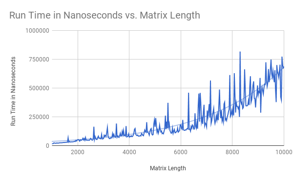

# RhombusCandy
## Puneet Johal, Nadine Jackson, Daniel Jiang
## APCS2 pd2
## L00 -- But What Does the Data Say?

### Hypothesis
If we run our matrix search method on matrices of increasing lengths, the runtime will also increase at a constant rate. In other words, the runtime of our MatrixFinder search is linear.

### Background
We devised class MatrixFinder with method search which takes an int parameter and a two dimensional int array parameter. This method will return the coordinates of the earliest occurrence (the one with the lowest index) of the integer in the matrix, or -1 if the number is not found, in the form of a String. We predicted that the runtime of our program was linear, given that the number of comparisons that needed to be made to search for the number, in the worst case (that the number was at the bottom left corner, \[matrix.length\]\[0\], or wasn't in the matrix at all), was equal to matrix.length. To test this, we created MFDriver, and input the data we collected into data.csv.

### Experimental Methodology
1. Test arrays from length 1,000 to 10,000, increasing the length by 25 each time.
2. Perform 1,000 warm-up trials on an array of length 1,000. Populate with integers in ascending order and search for the worst case.
3. For each different length array:
   * Instantiate a matrix and populate it with integers in ascending order, as per the requirement of MatrixFinder.search() (every row and column of the matrix must be sorted).
   * Run 10,000 timed searches on the matrix, each time searching for the worst case, the value at \[matrix.length\]\[0\]. After each search, add the time (in nanoseconds) to a total counter.
   * Divide the total time by 10,000 to find the average runtime and print matrix.length + "," + average time.
4. Compile and run the driver, replacing the standard output with the file data.csv in order to graph data and make it easier to analyze.

**Changes that were made to the experimental methodology:**

* Instead of populating the test matrices with random integers, we decided to populate them with integers in order. Not only did our initial design violate the precondition for our search algorithm (the rows and columns of the matrix must be sorted), but it also required us to instantiate a new matrix for each trial, making our program take longer to produce results, whereas if the matrix were to always be populated by integers in ascending order, we could just initialize a single matrix for each test case and perform all the trials on that same matrix.
* Decided to use System.nanoTime() instead of System.currentTimeMillis(), since it often took the smaller matrices less then a millisecond to complete the search and we wanted higher accuracy to produce a more representative graph.
* Increased the number of trials performed on each test case from 100 to 1,000 to 10,000 for more representative data (at a small cost in time)
* Increased the number of test cases. Before, we were only testing 91 different array lengths (every 100th array length from 1,000 to 10,000). We increased this to 361 by testing every 25th array length from 1,000 to 10,000 instead.
* Added "warm up" trials, to eliminate lag at the beginning affecting the runtimes of the smaller sized matrices

### Results
Link to our googsheet: [https://docs.google.com/spreadsheets/d/158PVPJVmrnwlHIDm--zrcxt6GDy1F1RMeUQLtwpFdFw/edit?usp=sharing](https://docs.google.com/spreadsheets/d/158PVPJVmrnwlHIDm--zrcxt6GDy1F1RMeUQLtwpFdFw/edit?usp=sharing)

### Conclusions
The data shows that our hypothesis was incorrect. While the runtime of the search method does increase as the length of the matrix increases, the rate at which it increases is not constant, as can be seen by the fact that the trend graph for the data is not linear, but exponential. This means that the larger the size of the data, the larger the difference between the runtimes of data sets that have the same difference in size. Also, taking a glance at the graph, you can see large peaks and dips in the data, especially with the larger matrix sizes. The reason for this variability can be explained by the number of experimental trials being performed on each different sized matrix. If we were to increase the number of trials, and the number of different test cases (which, in our experiment, was 361), the graph of our data would appear to be a smooth exponential progression.
